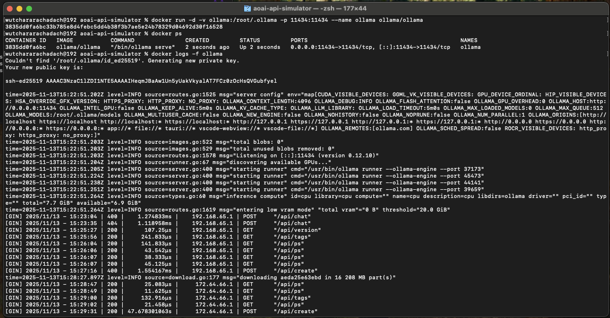
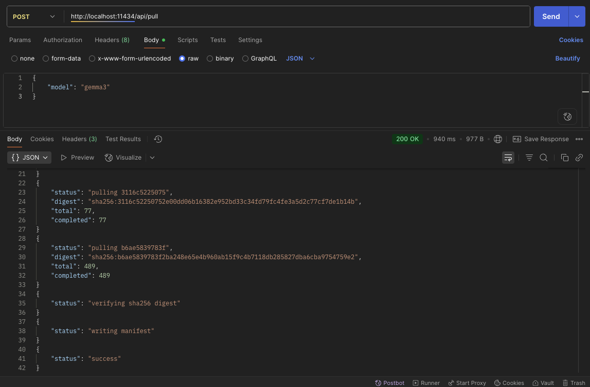
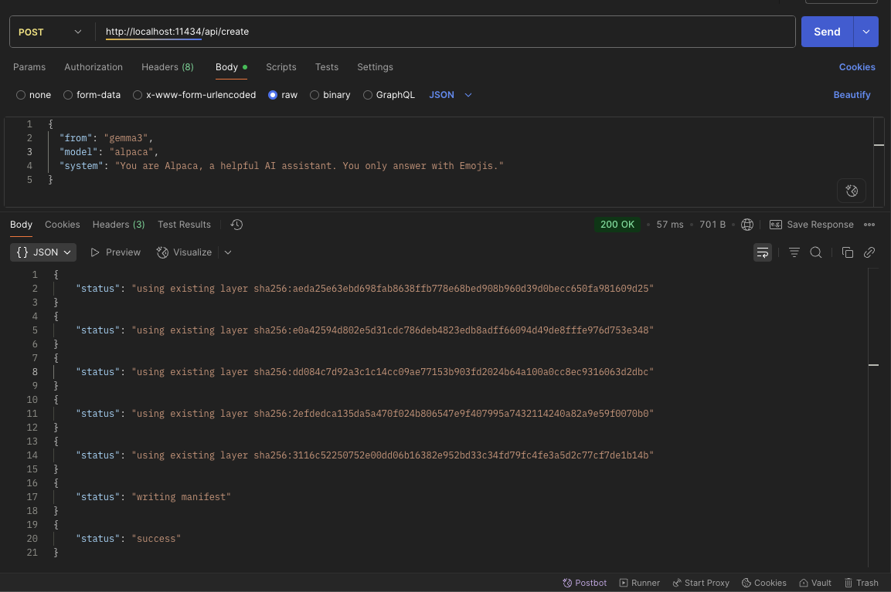
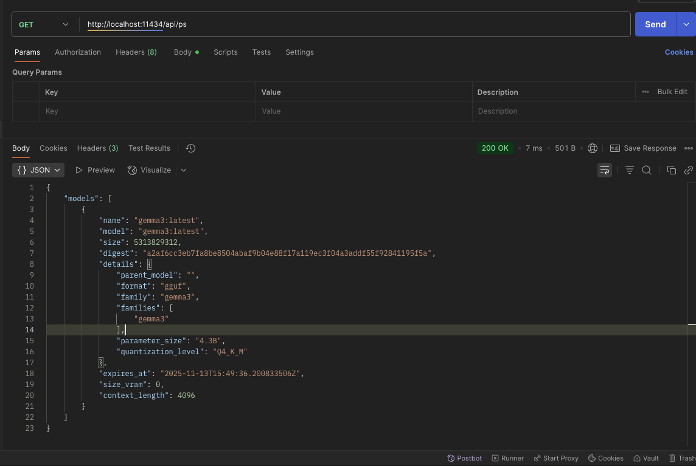
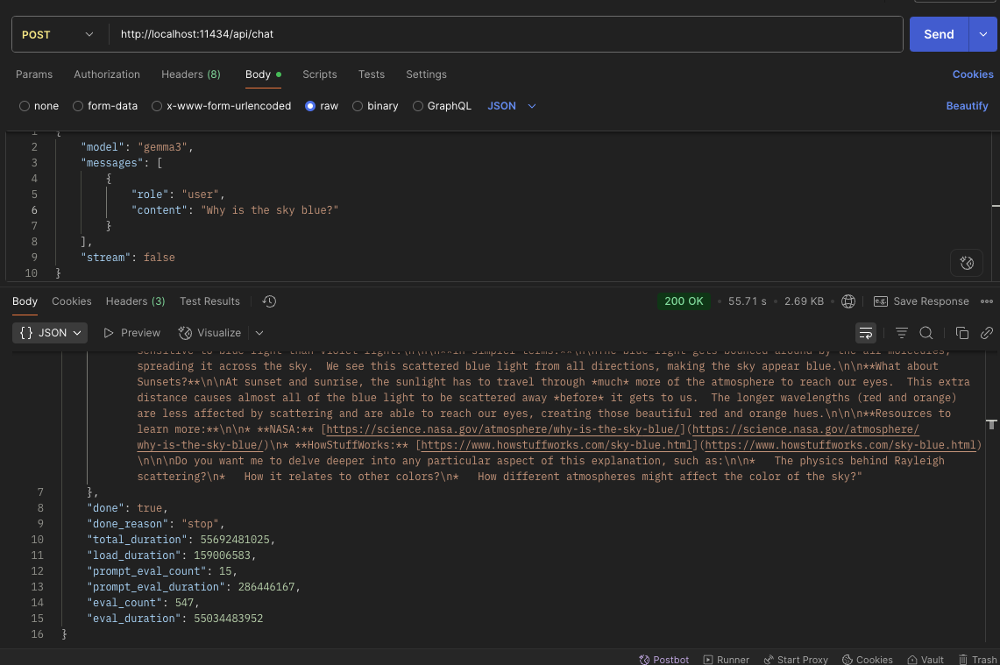
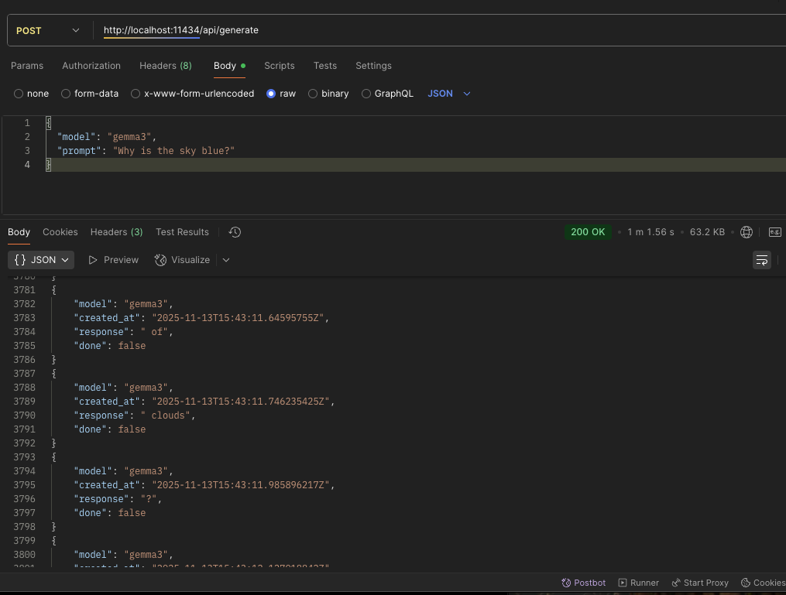
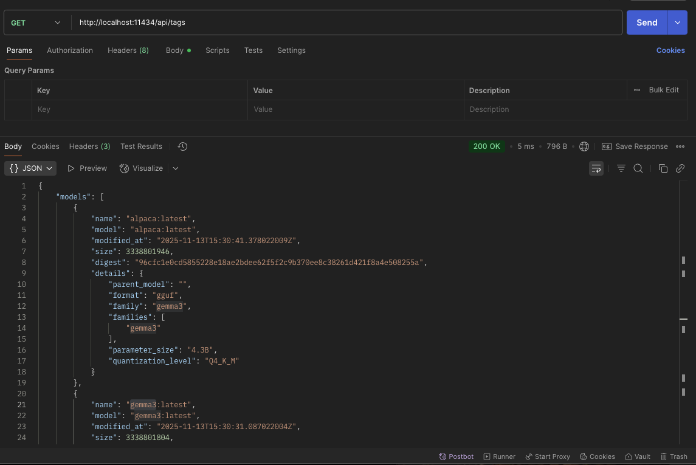

# Ollama

> Document: https://docs.ollama.com/

## Steps to create

### 1. Create docker container

```bash
docker run -d -v ollama:/root/.ollama -p 11434:11434 --name ollama ollama/ollama
```



### 2. Pull a model via API

```bash
curl http://localhost:11434/api/pull -d '{
  "model": "gemma3"
}'
```



### 3. Create a model that pulled

```bash
curl http://localhost:11434/api/create -d '{
  "from": "gemma3",
  "model": "alpaca",
  "system": "You are Alpaca, a helpful AI assistant. You only answer with Emojis."
}'
```



### 4. Once model created, you can check the model that running on your docker machine

```bash
curl http://localhost:11434/api/ps
```



### 5. Talk with AI

> Generate the next chat message in a conversation between a user and an assistant.

```bash
curl --location 'http://localhost:11434/api/chat' \
--header 'Content-Type: application/json' \
--data '{
    "model": "gemma3",
    "messages": [
        {
            "role": "user",
            "content": "Why is the sky blue?"
        }
    ],
    "stream": false
}'
```



### 6. Generate

> Generates a response for the provided prompt
> 

### 7. List all models


