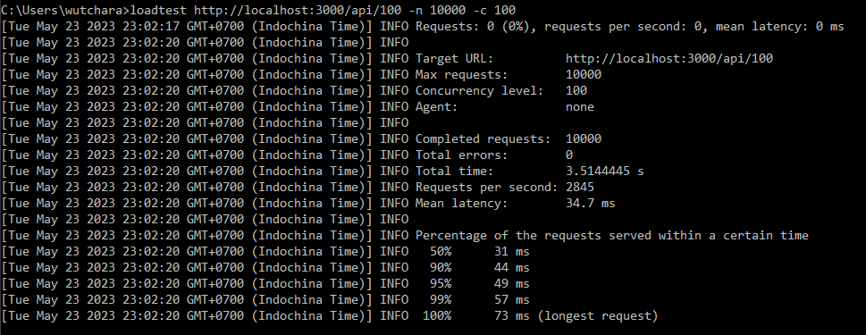

# Cluster Module

## Example 1
### Create worker node
```javascript
var cluster = require('cluster');

if (cluster.isWorker) {
  console.log('I am a worker');
} else {
  console.log('I am a master');
  cluster.fork();
  cluster.fork();
}
```

---

---

<br />

## Example 2

> <b>Please see ./example-2</b> <br />
> 'non-clister,js' is normal server <br />
> 'cluster.js' is cluster mode

<br />

'cluster.js'
```javascript
const express = require("express");
const port = 3000;
const cluster = require("cluster");
const totalCPUs = require("os").cpus().length;
 
if (cluster.isMaster) {
  console.log(`Number of CPUs is ${totalCPUs}`);
  console.log(`Master ${process.pid} is running`);
 
  // Fork workers.
  for (let i = 0; i < totalCPUs; i++) {
    cluster.fork();
  }
 
  cluster.on("exit", (worker, code, signal) => {
    console.log(`worker ${worker.process.pid} died`);
    console.log("Let's fork another worker!");
    cluster.fork();
  });
} else {
  const app = express();
  console.log(`Worker ${process.pid} started`);
 
  app.get("/", (req, res) => {
    res.send("Hello World!");
  });
 
  app.get("/api/:n", function (req, res) {
    let n = parseInt(req.params.n);
    let count = 0;
 
    if (n > 5000000000) n = 5000000000;
 
    for (let i = 0; i <= n; i++) {
      count += i;
    }
 
    res.send(`Final count is ${count}`);
  });
 
  app.listen(port, () => {
    console.log(`App listening on port ${port}`);
  });
}
```

console output
---

---

<br />


## Performance test
---

## summary (6 cores)
> Mean latency is (the average time it took to complete a single request)

|mode| loop |RPS|Mean latency|%RPS|%latency|
|----|----|----|----|----|----|
|non-cluster|200,000|1767|56 ms||
|cluster|200,000|2201|44.9 ms|+24.56%|-19.82%|
|non-cluster|500,000|1130|87.8 ms|||
|cluster|500,000|2203|44.7 ms|+94.96%|-49.09%|
|**non-cluster***|100|2845|34.7 ms|||
|**cluster***|100|2850|34.7 ms|+0.18%|0%|

<br />


---
<br />

## concurrent: 100; total request: 10,000; loop: 200,000
```bash
loadtest http://localhost:XXXX/api/200000 -n 1000 -c 100
```


<br />

## concurrent: 100; total request: 10,000; loop: 500,000
```bash
loadtest http://localhost:XXXX/api/500000 -n 1000 -c 100
```


<br />

## concurrent: 100; total request: 10,000; loop: 100
```bash
loadtest http://localhost:XXXX/api/100 -n 1000 -c 100
```




<br />


---

https://www.w3schools.com/nodejs/ref_cluster.asp

https://blog.appsignal.com/2021/02/03/improving-node-application-performance-with-clustering.html

https://enlear.academy/how-to-run-your-nestjs-server-in-cluster-mode-properly-acbbd4949732


