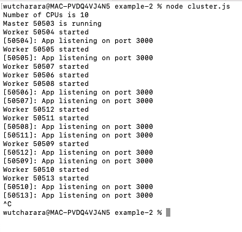

# Cluster Module

## Example 1
### Create worker node
```javascript
var cluster = require('cluster');

if (cluster.isWorker) {
  console.log('I am a worker');
} else {
  console.log('I am a master');
  cluster.fork();
  cluster.fork();
}
```

---

---

<br />

## Example 2

> <b>Please see ./example-2</b> <br />
> 'non-clister,js' is normal server <br />
> 'cluster.js' is cluster mode

<br />

'cluster.js'
```javascript
const express = require("express");
const port = 3000;
const cluster = require("cluster");
const totalCPUs = require("os").cpus().length;
 
if (cluster.isMaster) {
  console.log(`Number of CPUs is ${totalCPUs}`);
  console.log(`Master ${process.pid} is running`);
 
  // Fork workers.
  for (let i = 0; i < totalCPUs; i++) {
    cluster.fork();
  }
 
  cluster.on("exit", (worker, code, signal) => {
    console.log(`worker ${worker.process.pid} died`);
    console.log("Let's fork another worker!");
    cluster.fork();
  });
} else {
  const app = express();
  console.log(`Worker ${process.pid} started`);
 
  app.get("/", (req, res) => {
    res.send("Hello World!");
  });
 
  app.get("/api/:n", function (req, res) {
    let n = parseInt(req.params.n);
    let count = 0;
 
    if (n > 5000000000) n = 5000000000;
 
    for (let i = 0; i <= n; i++) {
      count += i;
    }
 
    res.send(`Final count is ${count}`);
  });
 
  app.listen(port, () => {
    console.log(`App listening on port ${port}`);
  });
}
```

console output
---

---

<br />


## Performance test
---


---

https://www.w3schools.com/nodejs/ref_cluster.asp

https://blog.appsignal.com/2021/02/03/improving-node-application-performance-with-clustering.html


