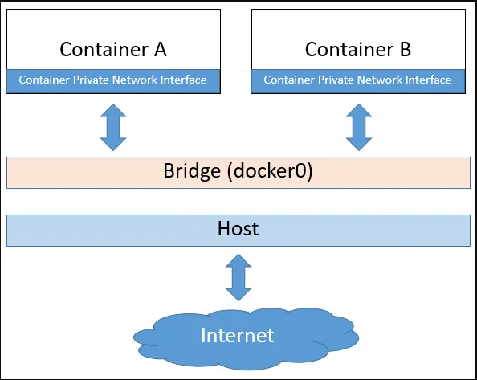
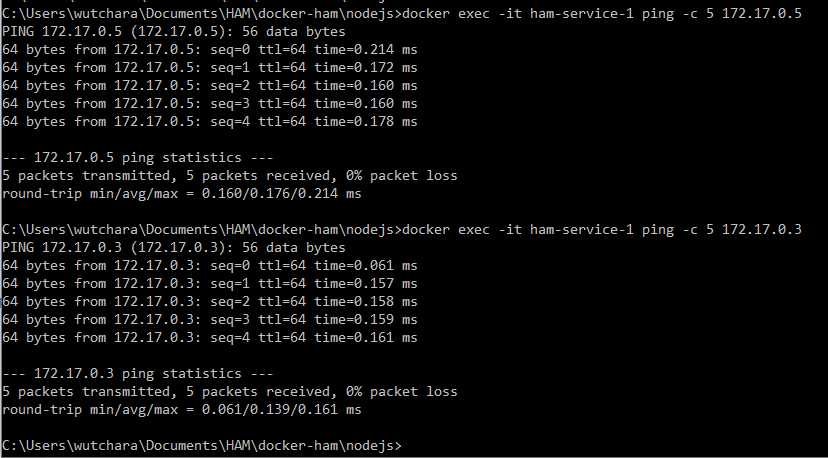

# Docker networks

- host
- bridge
- none



## 1. host
> Public network


<br />

## 2. bridge
> **Default mode**, this mode like a VPC on AWS.
<br />
> that's mean can separate network to disconnect each other and can connect them later


<br />

## 3. none
> Private network


---
---

## How to build docker image and docker container

```bash
# docker build -t {{IMAGE_NAME}}:{{IMAGE_TAG}} .
# docker run -d --name {{NAME}} -p {{LOCAL_PORT}}:{{DOCKER_PORT}} {{IMAGE_NAME}}:{{IMAGE_TAG}}
# e.g.
docker build -t ham-express:alpine .
docker run -d --name ham-service-1 -p 3001:3000 ham-express:alpine
```

<br />

## Test access docker networks
### Create docker container
```bash
docker run -d --name ham-service-1 -p 3001:3000 ham-express:alpine
docker run -d --name ham-service-2 -p 3002:3000 ham-express:alpine
docker run -d --name ham-service-3 ham-express:alpine
```


<br />

### Create docker container


<br />

### Test PING inside network

- container1 => container2
- container1 => container3




## Create custom network
```bash
docker network create --driver bridge ham-bridge
```


### test cross network
> You can't access cross network


<br />

### Allow custom network to connect other network
```bash
docker network connect bridge ham-service-4
```

<br />

### Test access network After connect the network
> Now!!!, You can access other network


<br />
<br />
<br />


## REF
- https://medium.com/@somprasongd/docker-networking-59b6637de3df
- https://www.metricfire.com/blog/what-is-docker-network-host/
- https://stackoverflow.com/questions/43316376/what-does-net-host-option-in-docker-command-really-do