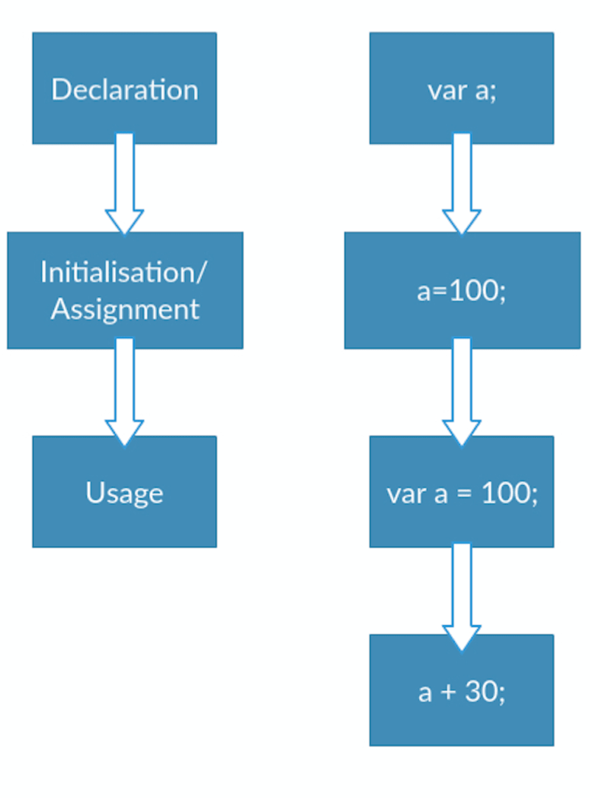

# Hoisting

> Hoisting is a JavaScript mechanism where variables and function declarations are moved to the top of their scope before code execution.

---

## Hoisting variables



example-1.js

```javascript
function hoist() {
  a = 20;
  var b = 100;
}

hoist();

console.log("aaaaaa", a); // 20
console.log("bbbbbbb", b); // error
```

---

## Hoisting functions

### Function declarations

```javascript
hoisted(); // Output: "This function has been hoisted."

function hoisted() {
  console.log("This function has been hoisted.");
}
```

### Function expressions

```javascript
expression(); //Output: "TypeError: expression is not a function

var expression = function () {
  console.log("Will this work?");
};
```

```javascript
expression(); // Output: TypeError: expression is not a function

var expression = function hoisting() {
  console.log("Will this work?");
};
```

---

## Order of precedence

> Variable assignment over function declaration

```javascript
var double = 22;

function double(num) {
  return num * 2;
}

console.log(typeof double); // Output: number
```

<br />

> Function declarations over variable declarations

```javascript
var double;

function double(num) {
  return num * 2;
}

console.log(typeof double); // Output: function
```

---

## Hoisting classes

### Class declarations

```javascript
var Frodo = new Hobbit();
Frodo.height = 100;
Frodo.weight = 300;
console.log(Frodo); // Output: ReferenceError: Hobbit is not defined

class Hobbit {
  constructor(height, weight) {
    this.height = height;
    this.weight = weight;
  }
}
```

```javascript
class Hobbit {
  constructor(height, weight) {
    this.height = height;
    this.weight = weight;
  }
}

var Frodo = new Hobbit();
Frodo.height = 100;
Frodo.weight = 300;
console.log(Frodo); // Output: { height: 100, weight: 300 }
```

<br />

### Class expressions

```javascript
var Square = new Polygon();
Square.height = 10;
Square.width = 10;
console.log(Square); // Output: TypeError: Polygon is not a constructor

var Polygon = class {
  constructor(height, width) {
    this.height = height;
    this.width = width;
  }
};
```

```javascript
var Square = new Polygon();
Square.height = 10;
Square.width = 10;
console.log(Square); // Output: TypeError: Polygon is not a constructor

var Polygon = class Polygon {
  constructor(height, width) {
    this.height = height;
    this.width = width;
  }
};
```

---

### Reference

- https://www.digitalocean.com/community/tutorials/understanding-hoisting-in-javascript
