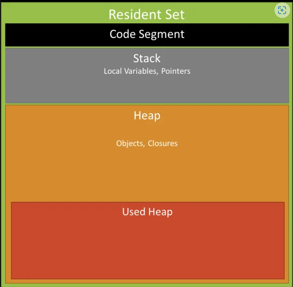
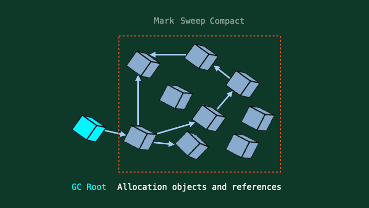

# Memory Leak

a memory leak is an orphan block of memory on the heap that is no longer used by the application and hasn't been returned to OS by the garbage collector. Then OS not having enough memory to allocate, leading to slowdowns/cashing.

 

---

## cause of memory leak in JS

- Global variable
  - large object
  - GC can't clear `this` object

- Multiple references

- Closures => closure is the function that reference to the variables in lexical scope (variable not a local scope)

- Timers and Events => settimeout, setinterval

---

## V8' memory schema

> (Stack faster than Heap)

 

---

## How GC work

---

---

# Avoid Memory leak

1. Reduce use of Global variable -> GC can't clean it.

2. Use Stack memory effectively
   - Avoid heap object references
   - Destructure and use fields from an object/array

3. Use Heap memory effectively
   - Copy object instated of passing references,
    if an object it huge -> copy operation is expensive
   - use `Object.assign` to copy (clear reference)
   - Avoid object mutation
   - Avoid creating multiple references to the same object
   - use short-lived variables
   - Avoid creating huge object trees.

---

### Reference

- https://blog.appsignal.com/2020/05/06/avoiding-memory-leaks-in-nodejs-best-practices-for-performance.html

- https://www.cloudbees.com/blog/understanding-garbage-collection-in-node-js

