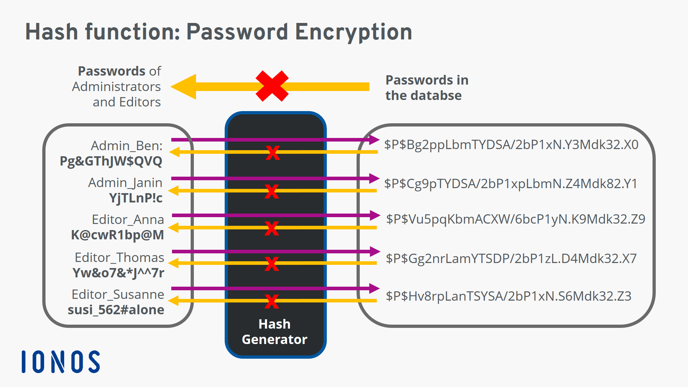
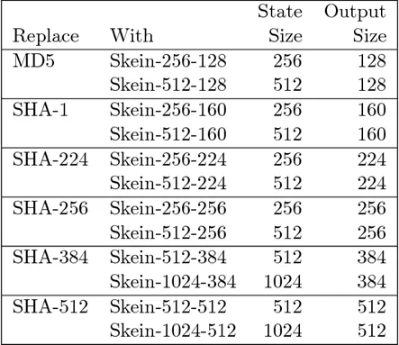
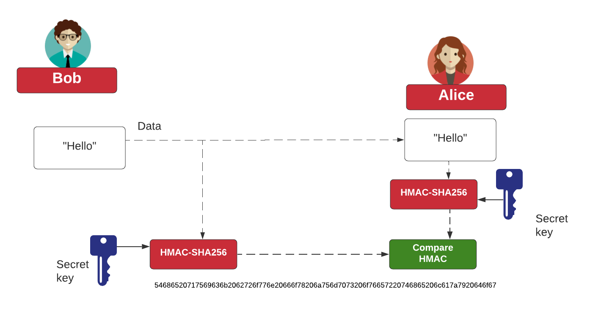
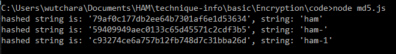
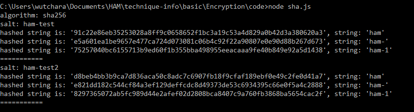
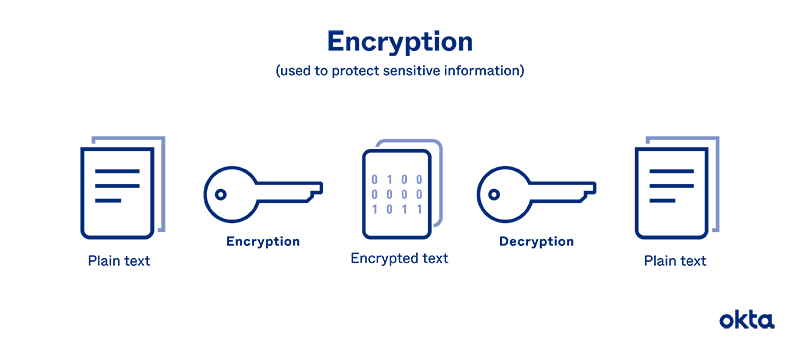
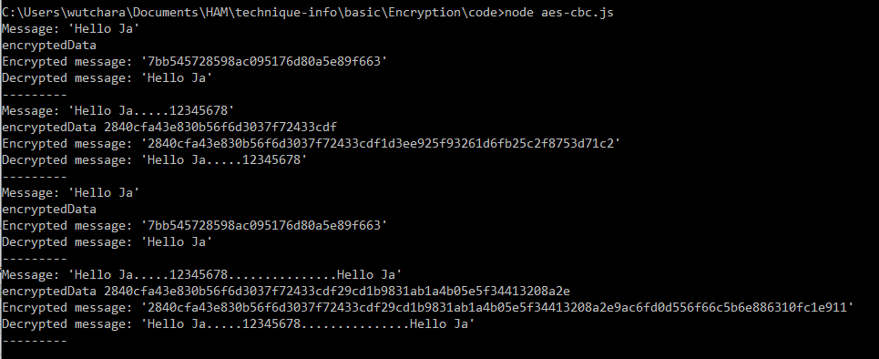
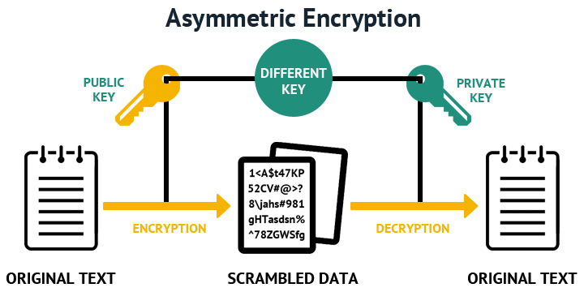
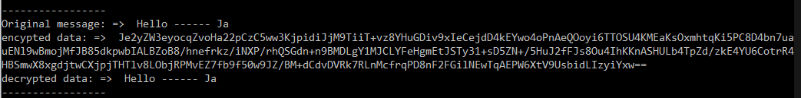

# Encoding (1 way encoding)

> Encoding is the process of putting a sequence of characters into a specialized format for efficient transmission or storage

- [Probability in Hashing](https://courses.cs.duke.edu/cps102/spring09/Lectures/L-18.pdf)
- [Hash Collision Probabilities](https://preshing.com/20110504/hash-collision-probabilities/)

<br />



<br />

- **Hashing function** => A hash function is a mathematical function that converts a numerical input value into another compressed numerical value.
- **MAC function** (Message Authenticaion Code) => cross check original message and result message
  - Hash + check sum = HMAC (Hash-based MAC)
- **KDF function** (Key Derivation Functions) is a cryptographic algorithm that derives one or more secret keys from a secret value such as a master key, a password, or a passphrase using a pseudorandom function
  - HMAC + salt(random) = HKDF (HMAC-based KDF)

<br />
(Algorithm )





<br />

## hash algorithm

- MD5 (message-digest algorithm) => MD5 hash code strings are limited to 128 bits
- SHA-256 (Secure Hash Algorithms) => The secure hash algorithm with a digest size of 256 bits

### MD5

```javascript
const md5 = require("md5");
const strArr = ["ham", "ham-", "ham-1"];

strArr.forEach((str) => {
  const hashStr = md5(str);
  console.log(`hashed string is: '${hashStr}', string: '${str}'`);
});
```



### SHA-256

```javascript
const crypto = require("crypto");
const algorithm = "sha256";
var salts = ["ham-test", "ham-test2"];
console.log(`algorithm: ${algorithm}`);

const strArr = ["ham", "ham-", "ham-1"];

salts.forEach((salt) => {
  console.log(`salt: ${salt}`);
  strArr.forEach((str) => {
    const hash = crypto.createHmac(algorithm, salt);
    hash.update(str);
    const myHash = hash.digest("hex");
    console.log(`hashed string is: '${myHash}', string: '${str}'`);
  });
  console.log("===========");
});
```



---

# Encryption (2 ways encoding)

> Encryption is a way for data—messages or files—to be made unreadable

- Algorithm
- Decryption
- Key

---

## Symmetric Key

- Triple DES(Data Encryption Standard)
- AES (Advanced Encryption Standard) => [Modes](https://www.highgo.ca/2019/08/08/the-difference-in-five-modes-in-the-aes-encryption-algorithm/)
  - [aes-128-cbc](https://stackoverflow.com/questions/33121619/is-there-any-difference-between-aes-128-cbc-and-aes-128-encryption)
  - [Key vs IV](https://stackoverflow.com/questions/9049789/aes-encryption-key-versus-iv)
    - IV should be unique



### AES-CBC

```javascript
const crypto = require("crypto");

// CBC(Cipher Block Chaining)
const algorithm = "aes-256-cbc";
const initVector = crypto.randomBytes(16);
const messages = [
  "Hello Ja",
  "Hello Ja.....12345678",
  "Hello Ja",
  "Hello Ja.....12345678...............Hello Ja",
];
const key = crypto.randomBytes(32);

const encript = (msg) => {
  const cipher = crypto.createCipheriv(algorithm, key, initVector);

  let encryptedData = cipher.update(msg, "utf-8", "hex");
  console.log("encryptedData", encryptedData);
  encryptedData += cipher.final("hex");

  return encryptedData;
};

const decript = (msg) => {
  const decipher = crypto.createDecipheriv(algorithm, key, initVector);

  let decryptedData = decipher.update(msg, "hex", "utf-8");
  decryptedData += decipher.final("utf8");

  return decryptedData;
};

const showMessage = (message) => {
  console.log(`Message: '${message}'`);
  const enMessage = encript(message);
  console.log(`Encrypted message: '${enMessage}'`);
  console.log(`Decrypted message: '${decript(enMessage)}'`);
};

messages.forEach((message) => {
  showMessage(message);
  console.log("---------");
});
```



<br />

## Asymmetric Key

- RSA



```javascript
const crypto = require("crypto");

const { publicKey, privateKey } = crypto.generateKeyPairSync("rsa", {
  modulusLength: 2048,
});

console.log(
  publicKey.export({
    type: "pkcs1",
    format: "pem",
  }),

  privateKey.export({
    type: "pkcs1",
    format: "pem",
  })
);
console.log("-----------------");

// Let's encrypt
const data = "Hello ------ Ja";
console.log("Original message: => ", data);

const encryptedData = crypto.publicEncrypt(
  {
    key: publicKey,
    padding: crypto.constants.RSA_PKCS1_OAEP_PADDING,
    oaepHash: "sha256",
  },
  Buffer.from(data)
);
console.log("encypted data: => ", encryptedData.toString("base64"));

// Let's decrypt
const decryptedData = crypto.privateDecrypt(
  {
    key: privateKey,
    padding: crypto.constants.RSA_PKCS1_OAEP_PADDING,
    oaepHash: "sha256",
  },
  encryptedData
);

console.log("decrypted data: => ", decryptedData.toString());
console.log("-----------------");
```



<br />

REF:

- https://bigdata.go.th/big-data-101/encoding-and-encryption-for-developers/

---

---

# The Future of Encryption

- [quantum cryptography](https://www.nist.gov/blogs/taking-measure/post-quantum-cryptography-qa-nists-matt-scholl)
