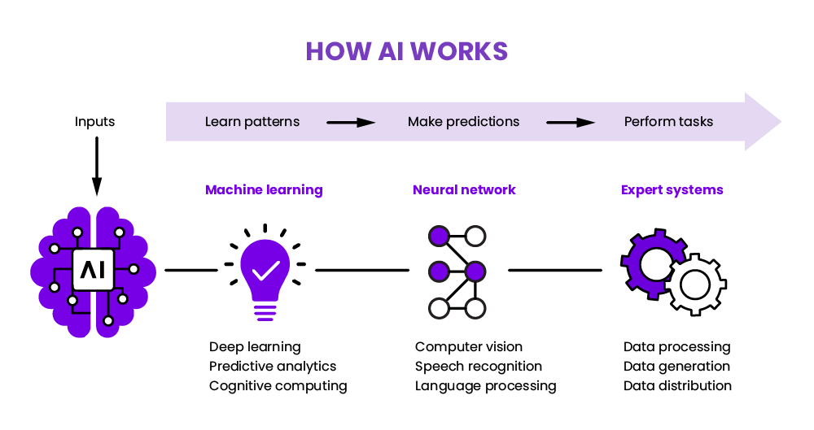
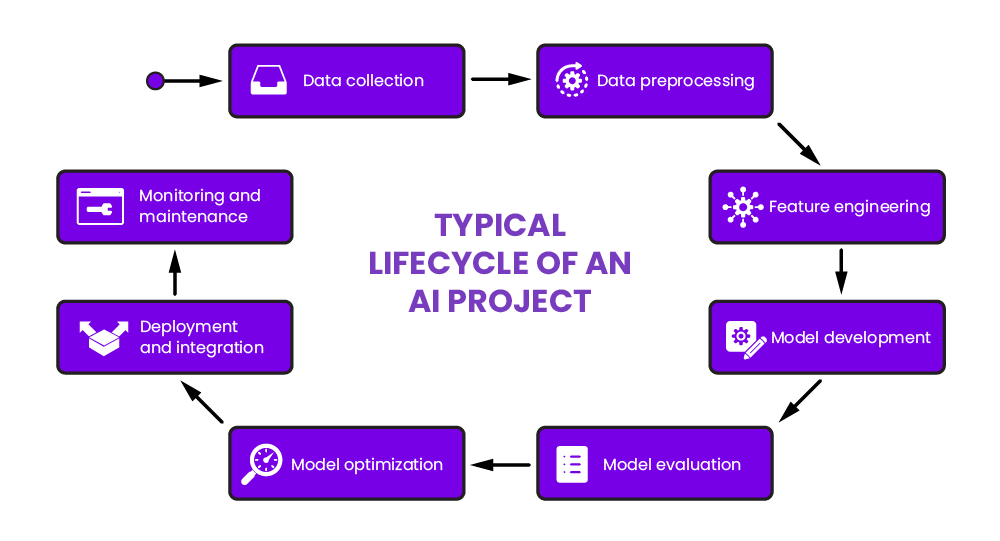
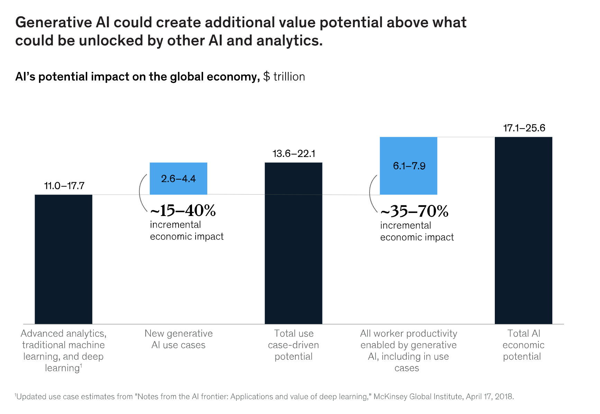
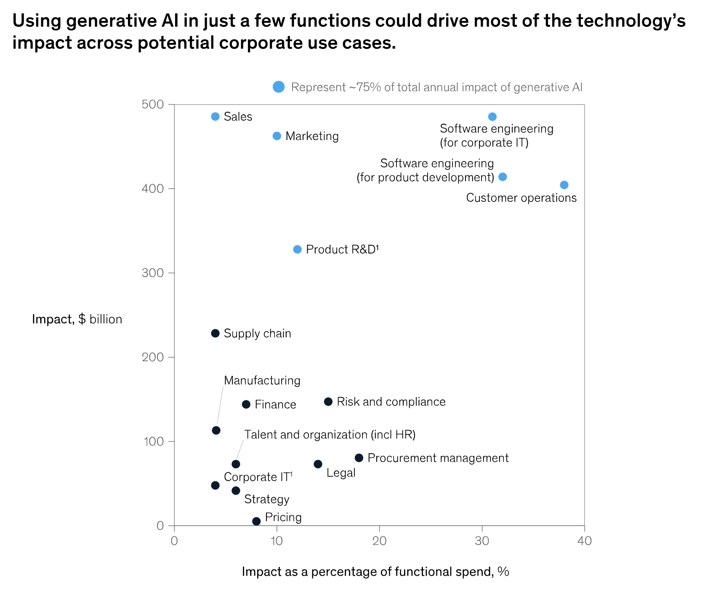

# Generative AI
> Generative AI is a type of artificial intelligence technology that can produce various types of content, including text, imagery, audio and synthetic data.

 

 

## How does generative AI work?
> Generative AI starts with a prompt that could be in the form of a text, an image, a video, a design, musical notes, or any input that the AI system can process. Various AI algorithms then return new content in response to the prompt. Content can include essays, solutions to problems, or realistic fakes created from pictures or audio of a person.

 

## Generative AI models
> Generative AI models combine various AI algorithms to represent and process content.

 

## Use cases
- Text Generation
    - ChatGPT 
- Code Generation
    - Github copilot
- Image Generation
    - Midjiourney
- Speech Generation/ AI Voice Generator
- Video & 3D Generation
    - Fliki

 

## Impacts

### Cost

### Jobs

 

## REF
- https://www.youtube.com/watch?v=9vRv7hXnrHg
- https://www.mckinsey.com/capabilities/mckinsey-digital/our-insights/the-economic-potential-of-generative-ai-the-next-productivity-frontier#business-value
- https://www.techtarget.com/searchenterpriseai/definition/generative-AI
- https://www.weka.io/learn/ai-ml/what-is-ai/
